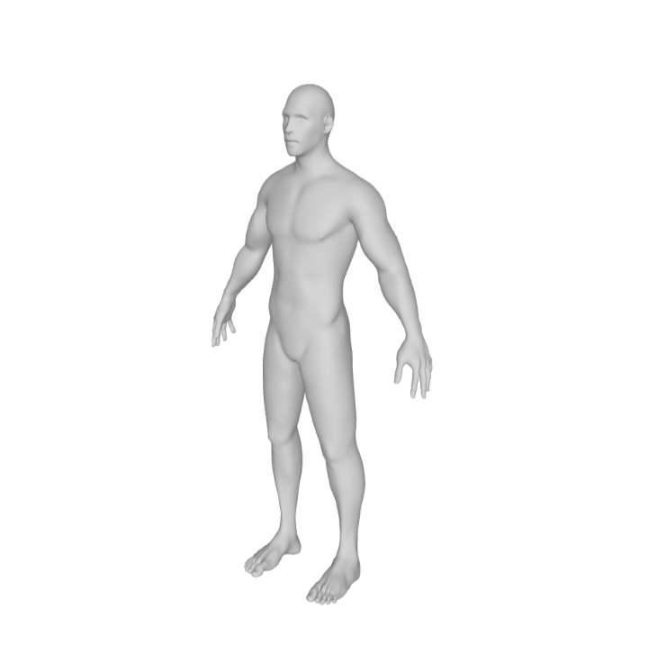
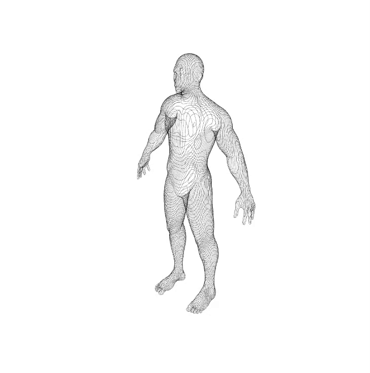

# 🌀 3D Contour Slicer

**3D Contour Slicer** is an interactive tool that slices 3D OBJ models into contour lines, generating beautiful cross-sectional visualizations. It enables artists, designers, and creative coders to explore the internal structure of 3D geometry through planar slicing and dynamic visualization.

Created with [p5.js](https://p5js.org/) and WebGL, this project allows for real-time manipulation of slicing parameters and exports results as SVG vector art.


<div style="display: flex; gap: 20px;">
  
  
</div>

---

## ✨ Features

- 🧱 Load and normalize OBJ mesh models
- 🔪 Interactive slicing along X, Y, and Z axes
- ✏️ Adjustable line spacing, thickness, and rotation
- 🎨 Custom line color picker
- 💾 Export output as SVG
- 🔁 Real-time rendering with orbit camera controls

---

## 🧪 Use with p5.js Web Editor

You can run this project directly in the [p5.js Web Editor](https://editor.p5js.org/):

1. Open the [p5.js Web Editor](https://editor.p5js.org/).
2. Create a new sketch.
3. Copy and paste your `sketch.js` code into the editor.
4. Upload your `.obj` file via **Sketch Files → Upload File** (must be named `FinalBaseMesh.obj` or adjust the filename in the code).
5. Hit **Play** ▶️ to run your sketch.

> Note: The p5.js editor runs in the browser, so WebGL and SVG functionality should work, but file handling might vary slightly across browsers.

---

## 🕹️ Controls

| Parameter                 | Description                              |
|--------------------------|------------------------------------------|
| Line Spacing             | Distance between slicing planes          |
| Line Thickness           | Stroke weight of contour lines           |
| Rotation Sliders (XYZ)   | Orientation of slicing planes            |
| Object Rotation (X)      | Spins the model itself                   |
| Line Color               | Pick the stroke color                    |
| Download SVG             | Saves current view as vector art         |

---

## 🧪 Example Use Cases

- Generative art and visual experimentation
- Architectural or industrial form exploration
- Teaching geometric transformations and cross-sections
- SVG export for laser cutting or plotter drawing

---

## 📁 Project Structure

```plaintext
.
├── sketch.js
├── FinalBaseMesh.obj  <-- your 3D model file
└── README.md
```

---


## 🧠 Inspiration

This project was inspired by topographic maps, architectural section drawings, and generative form exploration. It aims to bridge artistic intuition with technical control.

---

## 🛠️ Built With

- [p5.js](https://p5js.org/)
- WebGL rendering

---

## 📄 License

MIT License. Feel free to remix, experiment, and build on this!

---

